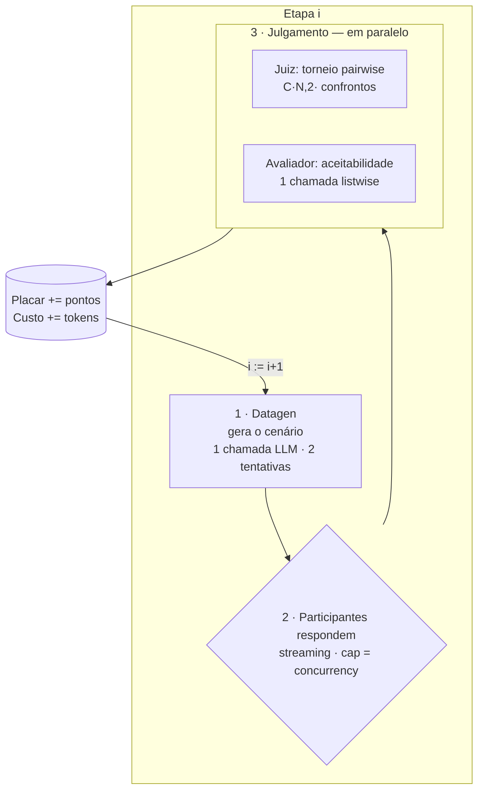
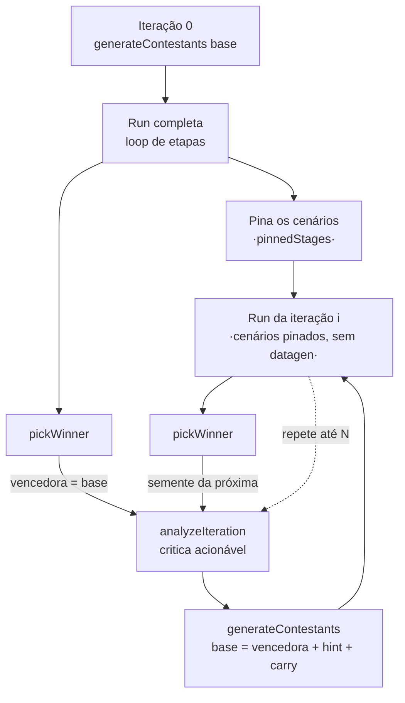

# Funcionamento do AI Benchmark — pipeline, modos e oportunidades de otimização

Documentação técnica profunda de **como o AI Benchmark executa**: a anatomia de uma etapa, os
três modos (`compare`, `variation`, `training`) e — fundamentado no código — **quais pontos são
sequenciais hoje e poderiam ser paralelizados/otimizados**.

> Complementa o [`README.md`](./README.md) (visão geral / como rodar) e o [`TELAS.md`](./TELAS.md)
> (as telas). Aqui o foco é o **motor de execução** em `src/`.

---

## Sumário

- [Glossário](#glossário)
- [A anatomia de uma etapa](#a-anatomia-de-uma-etapa)
- [Os três modos](#os-três-modos)
  - [compare — comparar modelos](#compare--comparar-modelos)
  - [variation — testar prompts](#variation--testar-prompts)
  - [training — treinar prompt](#training--treinar-prompt)
- [O que JÁ roda em paralelo hoje](#o-que-já-roda-em-paralelo-hoje)
- [O que é sequencial hoje e poderia ser otimizado](#o-que-é-sequencial-hoje-e-poderia-ser-otimizado)
- [Tabela-resumo de oportunidades](#tabela-resumo-de-oportunidades)
- [Ordem de implementação sugerida](#ordem-de-implementação-sugerida)
- [Caveats](#caveats)

---

## Glossário

| Termo | O que é | No código |
|---|---|---|
| **Run** | Uma execução de benchmark (compare ou variation) | `RunRecord`, `orchestrator.ts` |
| **Sessão** | Uma execução de **treino** (N runs encadeadas) | `SessionRecord`, `trainer.ts` |
| **Etapa** (*stage*) | Um mini-benchmark auto-contido: 1 cenário + respostas + julgamento | `StageRecord`, `StageSpec` |
| **Contestant** | Um participante. Em compare = um modelo; em variation/training = o mesmo modelo com um *system prompt* diferente | `Contestant` |
| **Datagen** | Modelo que gera o cenário da etapa (pergunta + contexto + maxTokens) | `datagen.ts` |
| **Juiz** | Ranqueia as respostas às cegas (torneio pairwise) | `judge.ts` |
| **Avaliador** | Diz, por resposta, se é "aceitável para o trabalho" | `evaluator.ts` |
| **Optimizer** | Modelo que reescreve prompts aplicando técnicas (variation/training) | `variator.ts` |

Papéis de modelo numa run: **participantes** (competidores/contestant) + **gerador** (`datagenModelId`)
+ **juiz** (`judgeModelId`, que acumula ranking **e** avaliação) + **optimizer** (`optimizerModelId`,
default = gerador).

---

## A anatomia de uma etapa

Toda run, em qualquer modo, é um **loop de N etapas** (`runLoop` em `src/orchestrator.ts`). Cada
etapa é independente e auto-contida:

Passo a passo (`runLoop`):

1. **Datagen** (`generateStage`): 1 chamada ao modelo gerador, em JSON-mode, com **2 tentativas** e
   timeout estendido `max(timeoutMs, 90s)`. Produz `{ question, productContext, maxTokens }`. Se
   falhar nas 2 tentativas, a **etapa é pulada** (`stage.failed`) — a run nunca trava.
2. **Participantes** (`runCompetitor`): cada contestant responde **em streaming** ao mesmo cenário
   (`productContext` vira o *system prompt*, salvo override do contestant; `question` é a mensagem do
   usuário). Rodam **em paralelo com teto** (`runWithLimit(tasks, concurrency)`). `maxTokens` efetivo
   = `min(maxOutputTokens, maxTokens do datagen)`. Cada competidor tem **1 retry** (sequencial).
   Falha → `status: 'error'` (resposta vazia) e segue.
3. **Juiz + Avaliador** (`Promise.allSettled`, em paralelo):
   - **Juiz** (`judgeStage`): **torneio round-robin pairwise** (Copeland). Para N respostas válidas,
     gera **C(N,2) = N·(N−1)/2 confrontos**; cada confronto é 1 chamada (ou 2, se `judgePasses: 2`).
     Confrontos rodam em paralelo com teto (hardcoded `concurrency = 6`). Pairwise é mais confiável
     que listwise quando as respostas são parecidas (caso do variation).
   - **Avaliador** (`evaluateStage`): **1 chamada listwise** que classifica cada resposta como
     aceitável/não. Respostas com erro/vazias já são "não aceitáveis" sem gastar LLM.
4. **Agregação**: `applyScoreboard` soma pontos (1º = N−1, … último = 0); custo acumula. Persiste o
   record e emite `stage.judged`.

> **Cego (blind):** antes do juiz/avaliador as respostas são embaralhadas e rotuladas `A, B, C…`.
> O `blindMap` guarda a correspondência só para a UI exibir "(era A)".

---

## Os três modos

O que muda entre os modos é **como os `contestants` são montados** e **se/como o loop se repete** —
o pipeline de etapa acima é o mesmo.

### compare — comparar modelos

- **Endpoint:** `POST /runs` · **Participantes:** ≥ 2 modelos distintos (`competitorModelIds`).
- Os contestants saem direto da config (`contestantsFromConfig`): cada um é `{ id===modelId }`, sem
  *system prompt* (usam o `productContext` do datagen).
- Roda o loop de etapas uma vez. Resultado: placar + heatmap + aceitabilidade por modelo.

### variation — testar prompts

- **Endpoint:** `POST /runs` · **Participante:** 1 modelo (`contestantModelId`) com **várias versões
  de *system prompt***.
- Os contestants são montados por `generateContestants` (`variator.ts`) **antes** do loop, via o hook
  `prepare` do orquestrador (emite `variants.generating`/`generated`):
  - **(opcional) controle**: o `basePrompt` do usuário, rodado *verbatim* (`isOriginal`).
  - **variantes**: com **otimização ligada**, o *optimizer* reescreve o base aplicando cada
    **técnica** selecionada — **uma variante por técnica, geradas em paralelo** (`Promise.all`); com
    otimização desligada, usa as `manualVariants` *verbatim* (sem LLM).
- Depois é o mesmo loop de etapas; todos os contestants compartilham o `modelId`, diferindo só pelo
  `systemPrompt`.

### training — treinar prompt

- **Endpoint:** `POST /sessions` · É uma **sessão** = N **iterações** encadeadas (`trainingLoop` em
  `trainer.ts`); cada iteração é uma run de variation completa.

Características:

- **Iteração 0** gera as variantes a partir do base, roda a run e **pina os cenários**
  (`pinnedStages`) — assim **todas as iterações usam as mesmas perguntas** (comparação justa) e o
  **datagen roda só uma vez na sessão**.
- **Iterações ≥ 1**: `analyzeIteration` (1 chamada ao optimizer) gera uma crítica acionável do prompt
  vencedor; `generateContestants` então deriva novas variantes da **vencedora** (+ a vencedora levada
  *verbatim* como `carry` + o controle original). A run usa os cenários pinados (**pula o datagen**).
- **`pickWinner`**: mais pontos → mais etapas aceitáveis → ordem. A vencedora é a semente da próxima.
- As **iterações são sequenciais por dependência de dados** (cada uma precisa da vencedora anterior).

---

## O que JÁ roda em paralelo hoje

Para situar a análise — o baseline atual de paralelismo:

| Onde | Como | Limite |
|---|---|---|
| Participantes de uma etapa | `runWithLimit(tasks, concurrency)` | `concurrency` da run (default 8) |
| Juiz × Avaliador | `Promise.allSettled([...])` | os dois juntos |
| Confrontos do juiz (pairwise) | `mapLimit(pairs, concurrency)` | **hardcoded 6** |
| Variantes por técnica (variator) | `Promise.all(techniques.map(...))` | **sem teto** |

---

## O que é sequencial hoje e poderia ser otimizado

Ordenado por **impacto**. Cada item aponta o local no código, por que é seguro, o ganho esperado e os
cuidados.

### 1. Etapas rodam 100% sequenciais (compare/variation) — **maior ganho de latência**

**Hoje:** `runLoop` é um `for (i = 0; i < stages; i++)` que só começa a etapa `i+1` quando a `i`
terminou por completo (datagen → participantes → juiz+avaliador → save).

**Por que dá para paralelizar:** em `compare`/`variation` as etapas são **independentes** — o próprio
prompt do datagen exige "etapa auto-contida: não referencie etapas anteriores", e o placar é
**aditivo** (`applyScoreboard` soma; a ordem não altera o total). O único estado compartilhado
(`record.scoreboard`, `record.totalCostUsd`, `record.stages[i]`) é mutado em JS *single-thread* (sem
condição de corrida real) e `saveRun` já é serializado por uma fila por run.

**Ganho:** wall-clock de ~`Σ(tempo de cada etapa)` para ~`max(tempo de etapa)` — até ~`N×` mais
rápido para N etapas, limitado por rate limit/orçamento.

**Como:** trocar o `for` por um *fan-out* com teto **global** (ex.: `runWithLimit(stageTasks, …)`),
ou uma versão conservadora **em pipeline** (começar o datagen/participantes da etapa `i+1` enquanto a
`i` está no juiz).

**Cuidados:** (a) hoje o teto de concorrência é **por etapa** (só dos participantes) — paralelizar
etapas exige um **orçamento global** de chamadas (senão N etapas × C participantes estouram o rate
limit); (b) precisa de **backoff em 429** (ver item 7); (c) a UI (`RunView`) já chaveia eventos por
`stageIndex`, então tende a tolerar várias etapas "ao vivo" — confirmar o comportamento visual.

### 2. Datagen sequencial no caminho crítico (compare/variation)

**Hoje:** o cenário da etapa `i` só é gerado quando a etapa `i−1` acabou — N chamadas de datagen
(lentas, JSON/reasoning, timeout até 90s) **em série** no caminho crítico.

**Por que dá:** as etapas são independentes → todos os cenários podem ser **pré-gerados em paralelo**
no início da run (com teto), exatamente como o training faz com `pinnedStages`. É um subconjunto do
item 1, mas vale isolado por ser barato e de baixo risco mesmo que as etapas continuem sequenciais.

**Ganho:** remove (N−1) datagens do caminho crítico.

**Como:** gerar `StageSpec[]` com `runWithLimit` antes do loop (reusar a infra de `pinnedStages`).

### 3. Etapas pinadas do training ainda rodam sequenciais (iterações ≥ 1)

**Hoje:** nas iterações ≥ 1 os cenários já estão **todos conhecidos** (`pinnedStages`), sem nenhuma
dependência de datagen — mas o `runLoop` ainda percorre as etapas em série.

**Por que dá:** zero dependência entre etapas pinadas. As **iterações** continuam sequenciais (isso é
inerente), mas o **loop interno de etapas de cada iteração** é totalmente paralelizável.

**Ganho:** cada iteração de treino fica ~`N(etapas)×` mais rápida — multiplicado por todas as
iterações. É o item 1 aplicado ao training (sai "de graça" se o item 1 for feito no `runLoop`).

### 4. `judgePasses: 2` faz os 2 passes em série por confronto

**Hoje:** em `judgePair`, a 2ª ordem (`judgeOneOrder`) só roda **depois** da 1ª (`await` sequencial),
dobrando a latência do juiz quando `passes = 2`.

**Por que dá:** as duas ordens são independentes (só comparamos os vencedores no fim).

**Ganho:** ~metade da latência do juiz no modo anti-viés (comum no variation).

**Como:** `Promise.all([judgeOneOrder(a,b), judgeOneOrder(b,a)])` e comparar. (O custo em tokens é o
mesmo; só muda a latência.)

### 5. Concorrência do juiz fixa em 6 e desligada da config; custo O(N²)

**Hoje:** `judgeStage` usa `concurrency ?? 6` e o `orchestrator` **não passa** concorrência — então é
sempre 6. Como o torneio é **pairwise round-robin**, são **O(N²)** confrontos: 8 variantes = 28
confrontos (× passes). É o **driver de custo/latência do variation/training** com muitas variantes.

**Por que/como:** (a) **fiar** a concorrência a partir da config; (b) para campos grandes, considerar
reduzir o O(N²) — torneio **suíço/seeding** ou *listwise* parcial em vez de round-robin completo.

**Ganho:** throughput e **custo** do juiz para muitas variantes.

### 6. `saveRun` reescreve o record inteiro a cada competidor (write amplification)

**Hoje:** `saveRun(record)` é chamado **dentro da task de cada competidor** (além de após cada etapa).
Como o record cresce, são ~O(S×C) escritas de JSON completo, cada vez maiores → ~O(S²×C) bytes
gravados ao longo da run. A fila por run evita corrupção, mas há amplificação de I/O.

**Por que/como:** o estado ao vivo já vai por **SSE** (o disco não precisa de cada delta). Dá para
**throttlar/coalescer** as gravações (ex.: salvar no máximo a cada X ms + sempre nos eventos
terminais), mantendo a persistência atômica.

**Ganho:** menos I/O e menos contenção na fila de save, sobretudo em runs grandes (e habilita melhor
o item 1, onde várias etapas salvariam concorrentemente).

### 7. Sem rate limiting / backoff global (pré-requisito dos itens 1–3)

**Hoje:** não há limitador **global** de chamadas nem **backoff em 429**. O competidor tem `retries:1`
e o datagen 2 tentativas, mas **sem espera** entre elas. Os tetos de concorrência são locais
(participantes por etapa; juiz fixo em 6).

**Por que/como:** ao paralelizar etapas (itens 1–3), o burst de chamadas sobe muito. É preciso um
**orçamento global de concorrência/tokens** (um único `limiter` compartilhado — hoje `runWithLimit`
e `mapLimit` são helpers duplicados que poderiam virar um só primitivo) e **retry com backoff
exponencial** no `openrouter.ts` para 429/5xx.

**Ganho:** robustez sob carga; é o que torna a paralelização de etapas viável na prática.

### 8. Variator sem teto de concorrência

**Hoje:** `generateContestants` dispara `Promise.all` de **todas** as técnicas de uma vez. Com muitas
técnicas + optimizer rate-limited, pode dar 429.

**Como:** aplicar o mesmo `mapLimit`/limiter global. Risco baixo (geralmente poucas técnicas), mas
fácil e consistente.

### 9. `getModel` por competidor (menor)

**Hoje:** `runCompetitor` chama `getModel(apiKey, modelId)` a cada resposta. É cacheado 24h
(`listModels`), mas faz um `find` na lista inteira toda vez.

**Como:** resolver os modelos uma vez por run e passar o `pricing` adiante. Ganho marginal (limpeza).

---

## Tabela-resumo de oportunidades

| # | Oportunidade | Tipo | Impacto | Esforço | Risco |
|---|---|---|---|---|---|
| 1 | Etapas em paralelo (compare/variation) | Paralelização | **Alto** (latência ~N×) | Médio | Médio (rate limit/UI) |
| 2 | Datagen pré-gerado em paralelo | Paralelização | Médio-alto | Baixo | Baixo |
| 3 | Etapas pinadas do training em paralelo | Paralelização | **Alto** (× iterações) | Baixo* | Médio |
| 4 | Passes do juiz em paralelo | Paralelização | Médio (quando passes=2) | Baixo | Baixo |
| 5 | Concorrência do juiz config + reduzir O(N²) | Otimização/custo | Médio-alto (muitas variantes) | Médio | Médio |
| 6 | Throttle do `saveRun` | Otimização I/O | Médio (runs grandes) | Baixo | Baixo |
| 7 | Rate limiter + backoff global | Robustez (pré-req) | Habilita 1–3 | Médio | Baixo |
| 8 | Teto no variator | Robustez | Baixo | Baixo | Baixo |
| 9 | `getModel` 1× por run | Limpeza | Baixo | Baixo | Baixo |

\* Esforço baixo **se** o item 1 for feito no `runLoop` (o training reusa o mesmo loop).

---

## Ordem de implementação sugerida

1. **Item 7** (limiter + backoff global) — fundação segura; unifica `runWithLimit`/`mapLimit`.
2. **Item 2** (datagen pré-gerado) — ganho rápido e de baixo risco, sem mexer no fluxo das etapas.
3. **Item 1 + 3** (etapas em paralelo no `runLoop`) — o grande ganho; o training herda de graça.
   Acompanhar de **item 6** (throttle do save) para a concorrência de etapas não martelar o disco.
4. **Itens 4 e 5** (juiz: passes paralelos + concorrência configurável / reduzir O(N²)) — para
   variation/training com muitas variantes.
5. **Itens 8 e 9** — limpezas de robustez.

---

## Caveats

- **Custo em tokens não muda** com paralelização (são as mesmas chamadas) — o que muda é **latência**
  e o **pico de uso** (mais chamadas simultâneas → mais risco de 429 e de estouro de orçamento).
- **Rate limits são o teto real:** sem o item 7, paralelizar etapas pode piorar a confiabilidade.
- **UX ao vivo:** hoje a `RunView` é desenhada em torno de "uma etapa por vez"; com etapas paralelas,
  vale revisar a apresentação (várias etapas "gerando/julgando" simultâneas) — os eventos já carregam
  `stageIndex`, então a base existe.
- **Training continua sequencial entre iterações** por dependência de dados — nenhuma otimização muda
  isso; o ganho lá está **dentro** de cada iteração (item 3).
- Os achados acima refletem o código em `src/orchestrator.ts`, `trainer.ts`, `variator.ts`,
  `competitor.ts`, `judge.ts`, `datagen.ts`, `evaluator.ts` — reconfira ao evoluir o pipeline. Vale
  destilar este conhecimento na skill [`knowledge-benchmark-modes`](./.agents/skills/knowledge-benchmark-modes/SKILL.md).
