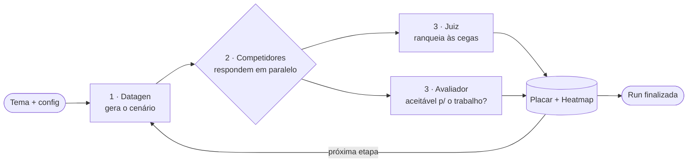
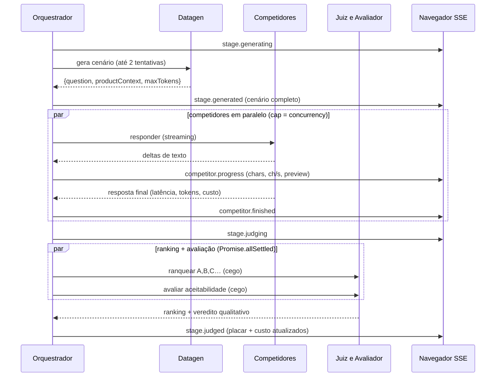

# AI Benchmark — Benchmark Arena

Arena de benchmark **paralelo** de LLMs sobre a [OpenRouter](https://openrouter.ai): você
dá um **tema**, o sistema **gera cenários** com um modelo, faz vários **modelos competidores**
responderem ao mesmo tempo, um **modelo juiz** ranqueia as respostas às cegas e a interface
mostra **placar, heatmap, custo e o texto sendo gerado token a token** — tudo ao vivo (SSE).

> **Em uma frase:** "dado um tema, descubra qual modelo responde melhor — e quais respostas
> são boas o bastante para usar no trabalho de verdade — com evidência, ranking e custo."

A documentação das **telas** (o que cada uma mostra e como se comporta) está em
[`TELAS.md`](./TELAS.md).

---

## Sumário

- [Como funciona (visão geral)](#como-funciona-visão-geral)
- [Os papéis dos modelos](#os-papéis-dos-modelos)
- [Anatomia de uma etapa](#anatomia-de-uma-etapa)
- [Sistema de pontuação](#sistema-de-pontuação)
- [Stack tecnológica](#stack-tecnológica)
- [Estrutura do projeto](#estrutura-do-projeto)
- [Configuração](#configuração)
- [Como rodar](#como-rodar)
- [Fluxo de eventos (SSE)](#fluxo-de-eventos-sse)
- [Referência da API](#referência-da-api)
- [Persistência](#persistência)
- [Exportação CSV](#exportação-csv)
- [Resiliência ("overkill")](#resiliência-overkill)
- [Segurança da API key](#segurança-da-api-key)
- [Notas e limitações](#notas-e-limitações)

---

## Como funciona (visão geral)

O backend orquestra um **pipeline em etapas**. Você define `N` etapas; cada etapa é um
mini-benchmark independente e auto-contido:



1. **Datagen** — um modelo recebe o tema e o índice da etapa e produz um **cenário**:
   uma pergunta de usuário (`question`), um **contexto de produto** (`productContext`, que
   vira o *system prompt* dos competidores: políticas, FAQs, dados, restrições) e um teto de
   tokens sugerido (`maxTokens`). Cada etapa varia o tipo de tarefa (extração, raciocínio,
   comparação, recusa, etc.).
2. **Competidores** — todos os modelos competidores respondem **ao mesmo cenário em paralelo**
   (com limite de concorrência), em *streaming*. A UI mostra o texto crescendo, a velocidade
   (chars/s), latência, tokens e custo de cada um.
3. **Juiz + Avaliador** — o **mesmo modelo juiz** roda **duas avaliações independentes e em
   paralelo** sobre as respostas anonimizadas:
   - **Juiz (ranking):** ordena da melhor para a pior. Vira pontos no placar e cores no heatmap.
   - **Avaliador (qualitativo):** escolhe o vencedor + explica *por que* venceu e dá, para
     cada resposta, um veredito de **aceitabilidade** ("dá para usar em produção sem causar
     erro/dano, mesmo não sendo a melhor?").
4. Repete para todas as etapas, acumulando placar e custo; ao final a run é marcada como
   `finished` e fica salva no histórico (com export JSON/CSV).

Tudo é transmitido ao navegador em tempo real via **Server-Sent Events (SSE)**.

---

## Os papéis dos modelos

Você configura **três papéis** (e um deles faz dois trabalhos):

| Papel | Quantos modelos | O que faz | Configuração |
|---|---|---|---|
| **Competidor** | **2 ou mais** | Respondem ao cenário e disputam o ranking | `competitorModelIds[]` |
| **Gerador (datagen)** | exatamente **1** | Inventa o cenário (pergunta + contexto + maxTokens) | `datagenModelId` |
| **Juiz** | exatamente **1** | Faz **ranking** *e* **avaliação qualitativa** (dois passes) | `judgeModelId` |

**Regras validadas no backend** (Zod, em `src/routes.ts`) — uma config inválida é recusada com `400`:

- pelo menos **2 competidores**, todos **distintos** (sem repetição);
- o **gerador** e o **juiz** precisam ser **modelos diferentes** entre si;
- nem o gerador nem o juiz podem **também** ser competidores.

Ou seja: cada modelo ocupa **um único papel** por run. (O juiz acumula os dois passes
ranking+avaliação por economia e consistência — é o mesmo modelo julgando de duas formas.)

---

## Anatomia de uma etapa



Pontos-chave da implementação (`src/orchestrator.ts`):

- **Datagen com folga e retry:** o timeout do datagen é `max(timeout da run, 90s)` e há
  **2 tentativas** antes de desistir.
- **Cego (blind):** antes de ir ao juiz/avaliador, as respostas são **embaralhadas** e
  rotuladas `A, B, C, …` — o juiz não sabe qual modelo é qual. A UI mostra depois "(era A)"
  para você conferir o mapeamento.
- **Ranking e avaliação em paralelo** via `Promise.allSettled`: um nunca derruba o outro
  (nem a run) se falhar.
- **Etapa isolada:** se o datagen falhar ou ocorrer qualquer imprevisto, a etapa é
  **marcada e pulada** — a run **nunca trava** por causa de uma etapa.

---

## Sistema de pontuação

Há **duas leituras complementares** de cada run:

### 1. Ranking competitivo (juiz) → placar e heatmap

A cada etapa, o juiz ordena as respostas. A pontuação é estilo "corrida":

> Com **N** respostas válidas: 1º lugar = **N−1** pontos, 2º = **N−2**, … último = **0**.
> Os pontos são **somados em todas as etapas** (`src/orchestrator.ts` → `applyScoreboard`).

O **heatmap** mostra a posição de cada modelo em cada etapa, colorida do **verde** (melhor)
ao **vermelho** (pior); `·` significa "não ranqueado naquela etapa".

A classificação final ordena por: **pontos** → **posição média** → **nº de 1ºs lugares** → id.

### 2. Aceitabilidade (avaliador) → "dá pra usar no trabalho?"

Independente do ranking, o avaliador classifica **cada** resposta como:

- ✅ **aceitável** — resolve a necessidade de forma correta e segura, **mesmo não sendo a melhor**;
- ❌ **não aceitável** — erro factual, viola contexto/política, informação de segurança incorreta,
  ou incompleta a ponto de não servir.

Respostas com **erro/vazias** são automaticamente **não aceitáveis** (sem gastar chamada de LLM).
O placar mostra, por modelo, em **quantas etapas** ele foi aceitável (ex.: `4/5 etapas (80%)`).

> É a diferença entre "**quem ganhou**" (ranking) e "**quem serve**" (aceitabilidade): um modelo
> pode quase nunca vencer e ainda assim ser aceitável em 100% das etapas.

---

## Stack tecnológica

**Backend**

- **Node.js** (ESM, `"type": "module"`) + **Express 4** — servidor HTTP e API.
- **TypeScript 5** (strict, `NodeNext`) — compilado para `dist/`.
- **Zod 4** — validação do corpo das requisições e dos JSONs devolvidos pelas LLMs.
- **`fetch` nativo do Node** — chamadas à OpenRouter (sem SDK), inclusive **streaming SSE**.
- **`EventEmitter` nativo** — barramento de eventos por run (`src/events.ts`).
- **`dotenv`** — carrega variáveis opcionais de um `.env`.
- Sem banco de dados: **persistência em arquivos JSON** (`data/runs/*.json`).

**Frontend** (`web/`)

- **React 18** + **React Router 6** — SPA com 4 telas.
- **Vite 5** — dev server (proxy de `/v1` e `/health` para o backend) e build.
- **TypeScript 5**.
- **`EventSource`** (SSE nativo do browser) para acompanhar a run ao vivo.
- **CSS puro** (`web/src/styles.css`) — tema escuro, sem framework de UI.

**Integração externa**

- **OpenRouter** — gateway único para todos os modelos (OpenAI, Anthropic, DeepSeek, Moonshot, …).
  Lista de modelos + preços via `GET /models`; geração via `POST /chat/completions`
  (streaming para competidores, JSON-mode para datagen/juiz); validação de key via `GET /key`.

---

## Estrutura do projeto

```
ai-benchmark/
├─ src/                      # Backend (TypeScript → dist/)
│  ├─ server.ts              # Express, /health, monta rotas, serve o front buildado, aborta órfãs
│  ├─ routes.ts              # Endpoints /v1/benchmark/* + validação Zod da config + SSE + CSV
│  ├─ orchestrator.ts        # Loop da run: datagen → competidores → juiz+avaliador → placar
│  ├─ datagen.ts             # Gera o cenário (question/productContext/maxTokens) em JSON
│  ├─ competitor.ts          # Roda 1 competidor (streaming, retry, progresso, custo)
│  ├─ judge.ts               # Juiz: ranking cego das respostas
│  ├─ evaluator.ts           # Avaliador: vencedor + motivos + aceitabilidade (cego)
│  ├─ openrouter.ts          # Cliente OpenRouter: models, chat, stream, custo, validateKey
│  ├─ events.ts              # Barramento de eventos (EventEmitter) por runId
│  ├─ storage.ts             # JSON em data/runs/*.json (escrita atômica, fila por run)
│  └─ types.ts               # Tipos compartilhados + união de RunEvent
│
├─ web/                      # Frontend (React + Vite)
│  ├─ index.html
│  ├─ vite.config.ts         # Porta 5173 + proxy /v1 e /health → :3001
│  └─ src/
│     ├─ main.tsx            # Router, layout, topbar/navegação
│     ├─ api.ts              # Cliente HTTP/SSE + tipos + key no localStorage
│     ├─ styles.css          # Tema escuro (design system)
│     ├─ components/
│     │  ├─ KeySetup.tsx     # Input da key + validação; KeyGate (bloqueia /new sem key)
│     │  └─ ModelSelector.tsx# Busca fuzzy de modelos com preços (chips)
│     └─ pages/
│        ├─ NewRun.tsx       # Formulário de nova run
│        ├─ RunsList.tsx     # Histórico (tabela)
│        ├─ RunView.tsx      # Run ao vivo: placar, heatmap, etapas, respostas
│        └─ Settings.tsx     # Configurações (a key)
│
├─ data/runs/                # Runs persistidas (gitignored, criado em runtime)
├─ .env.example              # Variáveis OPCIONAIS (o app roda sem .env)
├─ tsconfig.json             # TS do backend
├─ package.json              # Scripts (dev/build/start) + deps do backend
├─ README.md                 # Este arquivo
└─ TELAS.md                  # Documentação descritiva das telas
```

> As pastas `pipelines/` e `.huu/` (quando presentes) são artefatos de ferramentas locais de
> automação/auditoria — **não fazem parte do runtime do app**.

---

## Configuração

**Não é preciso nenhum `.env` para rodar** — todos os parâmetros têm default. A **chave do
OpenRouter não vai em variável de ambiente**: você cola na própria interface (tela de
**Configurações** / *gate* da tela de Nova Run) e ela fica no `localStorage` do navegador,
sendo enviada ao backend apenas no header `x-openrouter-key`.

Variáveis **opcionais** (veja `.env.example`):

| Variável | Default | Para quê |
|---|---|---|
| `OPENROUTER_BASE_URL` | `https://openrouter.ai/api/v1` | Apontar para um proxy/gateway compatível |
| `OPENROUTER_APP_URL` | `http://localhost:3000` | Header `HTTP-Referer` de atribuição na OpenRouter |
| `OPENROUTER_APP_TITLE` | `Benchmark Arena` | Header `X-Title` de atribuição na OpenRouter |
| `BENCHMARK_PORT` | `3001` | Porta do backend |

Parâmetros da **run** (ajustáveis na tela de Nova Run, validados no backend):

| Campo | Faixa | Default (UI) |
|---|---|---|
| `stages` (etapas) | 1–50 | 5 |
| `concurrency` (concorrência) | 1–32 | 8 |
| `timeoutMs` | 1.000–300.000 | 60.000 |
| `maxOutputTokens` | 50–16.000 | 500 |

`maxOutputTokens` é um **teto absoluto** da resposta dos competidores; o efetivo é
`min(maxOutputTokens, maxTokens sugerido pelo datagen)`.

---

## Como rodar

Um **único `npm install`** instala as dependências do backend **e** do front (`web/`) — o
script `postinstall` cuida do `web/`.

### Desenvolvimento

```bash
npm install
npm run dev      # backend em :3001 (tsx watch) + Vite em :5173 (proxy de /v1 e /health)
```

Abra **`http://localhost:5173`** e cole sua chave OpenRouter na tela de setup.

### Produção

```bash
npm install
npm run build    # compila o backend (dist/) e o front (web/dist/)
npm run start    # serve API + frontend juntos em http://localhost:3001
```

Em produção o Express serve o front buildado (`web/dist`) e faz *fallback* de SPA para
qualquer rota que não comece com `/v1` ou `/health`.

### Scripts disponíveis (`package.json`)

| Script | O que faz |
|---|---|
| `npm run dev` | Backend (watch) + Vite, em paralelo (`concurrently`) |
| `npm run build` | `tsc` do backend + `vite build` do front |
| `npm run start` | Roda o backend compilado (`dist/server.js`) |
| `npm run web:dev` / `web:build` / `web:install` | Atalhos para o subprojeto `web/` |

---

## Fluxo de eventos (SSE)

O backend mantém um **barramento de eventos por run** (`src/events.ts`). Ao abrir
`GET /v1/benchmark/runs/:id/events`, o cliente recebe primeiro um `snapshot` com o estado
atual e depois o *stream* incremental. A UI (`web/src/pages/RunView.tsx`) aplica cada evento
sobre o estado local (`applyEvent`), sem precisar recarregar.

| Evento | Quando | Carrega |
|---|---|---|
| `snapshot` | Ao conectar | Record completo da run |
| `run.started` | Início | Record inicial |
| `stage.generating` | Datagen começou | `stageIndex` |
| `stage.generated` | Cenário pronto | `spec` (question/context/maxTokens) |
| `stage.failed` | Datagen/imprevisto falhou (etapa pulada) | `error` |
| `competitor.started` | Um competidor iniciou | `modelId` |
| `competitor.progress` | A cada ~150 ms de streaming | `chars`, `charsPerSec`, `preview` |
| `competitor.finished` | Competidor terminou | `response` (texto, latência, tokens, custo) |
| `stage.judging` | Indo para o juiz | `stageIndex` |
| `stage.judged` | Ranking+avaliação prontos | `judge`, `evaluation`, `scoreboard`, `totalCostUsd` |
| `run.finished` | Fim normal | Record final |
| `run.error` | Erro fatal da run | `error` |

Runs **terminais** (`finished`/`error`/`aborted`) não abrem stream "vivo": o servidor manda o
evento terminal e fecha; o cliente fecha o `EventSource` (sem reconexão infinita). Há
*keepalive* a cada 15 s para conexões abertas.

---

## Referência da API

Base: `/v1/benchmark`. A key vai no header **`x-openrouter-key`** (quando exigida).

| Método | Rota | Key? | Descrição |
|---|---|:---:|---|
| `POST` | `/validate-key` | header **ou** `body.apiKey` | Valida a key contra `GET /key` da OpenRouter; devolve metadados (label, uso, limite, free tier) |
| `GET` | `/models` | ✅ | Lista modelos da OpenRouter com pricing (cache de 24 h por key) |
| `POST` | `/runs` | ✅ | Valida a config (Zod) + *pre-flight* da key e inicia a run; responde **`202 { runId }`** |
| `GET` | `/runs` | — | Histórico (resumos, mais recentes primeiro) |
| `GET` | `/runs/:id` | — | Record completo da run |
| `GET` | `/runs/:id/events` | — | **Stream SSE** em tempo real |
| `GET` | `/runs/:id/export.csv` | — | Exporta os resultados em CSV |
| `GET` | `/health` | — | Health check: `{ "status": "ok", "service": "benchmark-arena" }` |

**Exemplo — iniciar uma run:**

```bash
curl -X POST http://localhost:3001/v1/benchmark/runs \
  -H "Content-Type: application/json" \
  -H "x-openrouter-key: sk-or-v1-..." \
  -d '{
    "theme": "Atendimento de clínica de exames com FAQs e políticas",
    "stages": 5,
    "competitorModelIds": ["openai/gpt-5-mini", "openai/gpt-5-nano"],
    "datagenModelId": "deepseek/deepseek-v4-pro",
    "judgeModelId": "moonshotai/kimi-k2.6",
    "concurrency": 8,
    "timeoutMs": 60000,
    "maxOutputTokens": 500
  }'
# -> 202 { "runId": "..." }   (acompanhe em /runs/:id/events)
```

> A rota `POST /runs` faz um **pre-flight** da key (valida **antes** de começar) para falhar
> rápido com mensagem clara, em vez de quebrar lá na etapa 1.

---

## Persistência

Cada run é salva como `data/runs/<runId>.json` (`src/storage.ts`). O diretório `data/` é
**gitignored** e criado em runtime. Características:

- **Escrita atômica:** grava em um `*.tmp` com nome **único por escrita** e faz `rename`
  (evita corrupção e o `ENOENT` que ocorria quando vários competidores salvavam juntos).
- **Fila por run:** as gravações de uma mesma run são **serializadas** (cada competidor salva
  ao terminar) para não se atropelarem.
- **Órfãs viram `aborted`:** ao subir, o servidor varre runs em estado `running` (que ficaram
  presas por um restart) e as marca como `aborted` (`markOrphansAsAborted`).
- O **histórico** (`listRuns`) lê os JSONs, monta resumos e ignora arquivos corrompidos.

---

## Exportação CSV

`GET /runs/:id/export.csv` gera **uma linha por resposta de competidor**, com escaping correto:

```
runId, stageIndex, question, modelId, status, latencyMs, tokensIn, tokensOut, costUsd, rankPosition, errorMsg, text
```

`rankPosition` é a posição (1-based) atribuída pelo juiz naquela etapa (vazio se não ranqueado).

---

## Resiliência ("overkill")

O sistema é deliberadamente à prova de falhas — uma run longa não pode morrer por causa de
um soluço de rede ou de um modelo:

- **Etapa isolada:** falha de datagen ou imprevisto **pula a etapa**, não mata a run.
- **Datagen com 2 tentativas** e timeout estendido (`max(timeout, 90s)`).
- **Competidor com retry** (`retries: 1` → até 2 tentativas); se falhar, vira `status: error`
  (resposta vazia) e segue — o juiz simplesmente ignora respostas inválidas.
- **Juiz e avaliador em `Promise.allSettled`:** um falhando não derruba o outro nem a run;
  uma etapa "inconclusiva" apenas não pontua.
- **Casos-limite do juiz:** 0 respostas válidas → inconclusiva; 1 resposta → auto-ranqueada.
- **Escrita atômica + fila por run** na persistência.
- **Timeouts via `AbortController`** em toda chamada à OpenRouter.
- **Mensagens de erro traduzidas** (401/403 = key inválida; 402 = sem crédito; 429 = rate limit).

---

## Segurança da API key

- A key **nunca** fica em `.env` nem no servidor: vive no **`localStorage`** do navegador e é
  enviada **só** no header `x-openrouter-key` das chamadas que precisam dela.
- O backend **não persiste** a key — ela é usada na requisição e descartada.
- A validação usa o endpoint **autenticado** `GET /key` (e não `/models`, que é público e
  responderia `200` até para uma key inválida), então uma key ruim é barrada **na hora**.
- O SSE de acompanhamento **não exige key** (a key só é necessária para *iniciar* a run).

---

## Notas e limitações

- **Custo total exibido = soma das respostas dos competidores.** As chamadas de datagen, juiz
  e avaliador **não** entram no `totalCostUsd` (o foco da métrica é o custo da inferência que
  está sendo comparada). Os preços vêm do catálogo da OpenRouter (`pricing.prompt`/`completion`).
- **Sem autenticação de usuário / multiusuário:** é uma ferramenta local de benchmark; o
  histórico é compartilhado por quem acessa o servidor.
- **Persistência em arquivo** (não em banco): ótimo para uso local, não pensado para alta
  concorrência de muitas runs simultâneas em escala.
- Os **modelos default** na tela de Nova Run são apenas sugestões editáveis — troque pelos
  modelos que você realmente quer comparar usando a busca do seletor.

---

Para entender **cada tela** em detalhe (campos, estados, cores, comportamento ao vivo), veja
**[`TELAS.md`](./TELAS.md)**.
