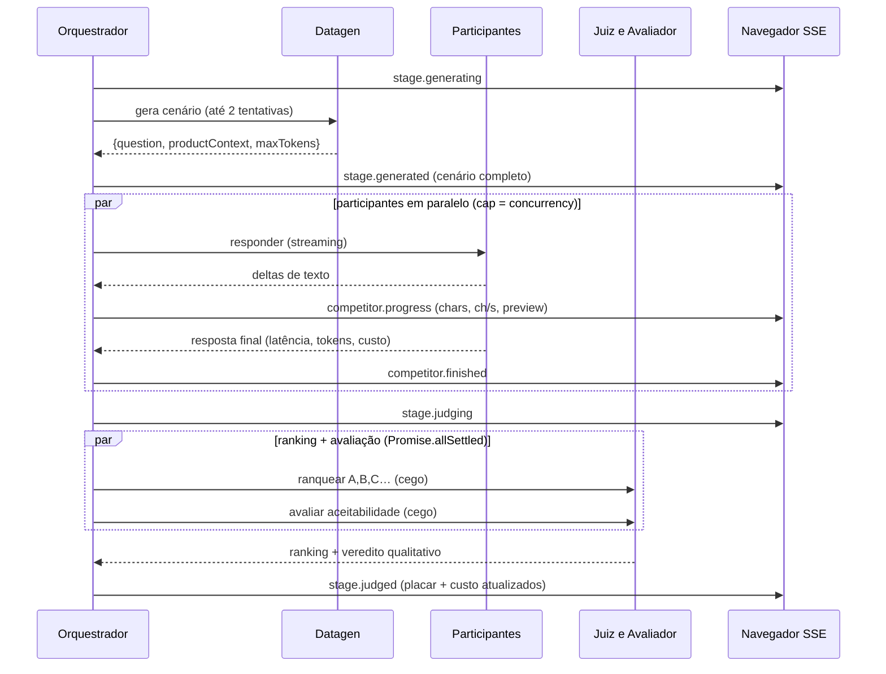

# AI Benchmark — Benchmark Arena

Arena de benchmark **paralelo** de LLMs sobre a [OpenRouter](https://openrouter.ai). Em três
modos: **comparar** vários modelos no mesmo desafio, **testar** vários prompts em um modelo, ou
**treinar** um prompt que evolui sozinho. Você dá um **tema**, o sistema **gera cenários** com um
modelo, faz os **participantes** responderem ao mesmo tempo, um **modelo juiz** ranqueia às cegas e
a interface mostra **placar, heatmap, custo e o texto sendo gerado token a token** — tudo ao vivo (SSE).

> **Em uma frase:** "dado um tema, descubra qual modelo (ou qual prompt) responde melhor — e quais
> respostas são boas o bastante para usar no trabalho de verdade — com evidência, ranking e custo."

A documentação das **telas** está em [`TELAS.md`](./TELAS.md). Convenções para **agentes de código**
(Claude Code, Codex, Cursor…) estão em [`AGENTS.md`](./AGENTS.md) e na biblioteca de skills em
[`.agents/skills/`](./.agents/skills/) — veja [Sistema de Knowledge Skills](#sistema-de-knowledge-skills).

---

## Sumário

- [Como funciona (visão geral)](#como-funciona-visão-geral)
- [Os três modos](#os-três-modos)
- [Os papéis dos modelos](#os-papéis-dos-modelos)
- [Conformidade LGPD (filtro consultivo)](#conformidade-lgpd-filtro-consultivo)
- [Anatomia de uma etapa](#anatomia-de-uma-etapa)
- [Sistema de pontuação](#sistema-de-pontuação)
- [Stack tecnológica](#stack-tecnológica)
- [Estrutura do projeto](#estrutura-do-projeto)
- [Sistema de Knowledge Skills](#sistema-de-knowledge-skills)
- [Configuração](#configuração)
- [Como rodar](#como-rodar)
- [Fluxo de eventos (SSE)](#fluxo-de-eventos-sse)
- [Referência da API](#referência-da-api)
- [Persistência](#persistência)
- [Exportação CSV](#exportação-csv)
- [Resiliência ("overkill")](#resiliência-overkill)
- [Segurança da API key](#segurança-da-api-key)
- [Notas e limitações](#notas-e-limitações)

---

## Como funciona (visão geral)

O backend orquestra um **pipeline em etapas**. Você define `N` etapas; cada etapa é um
mini-benchmark independente e auto-contido:


1. **Datagen** — um modelo recebe o tema e o índice da etapa e produz um **cenário**:
   uma pergunta de usuário (`question`), um **contexto de produto** (`productContext`, que
   vira o *system prompt*: políticas, FAQs, dados, restrições) e um teto de tokens sugerido
   (`maxTokens`). Cada etapa varia o tipo de tarefa (extração, raciocínio, comparação, recusa…).
2. **Participantes** — respondem **ao mesmo cenário em paralelo** (com limite de concorrência),
   em *streaming*. A UI mostra o texto crescendo, a velocidade (chars/s), latência, tokens e custo.
3. **Juiz + Avaliador** — o **mesmo modelo juiz** roda **duas avaliações independentes e em
   paralelo** sobre as respostas anonimizadas:
   - **Juiz (ranking):** ordena da melhor para a pior. Vira pontos no placar e cores no heatmap.
   - **Avaliador (qualitativo):** escolhe o vencedor + explica *por que* venceu e dá, para cada
     resposta, um veredito de **aceitabilidade** ("dá para usar em produção sem causar erro/dano?").
4. Repete para todas as etapas, acumulando placar e custo; ao final a run é `finished` e fica no
   histórico (com export JSON/CSV).

Tudo é transmitido ao navegador em tempo real via **Server-Sent Events (SSE)**.

---

## Os três modos

O assistente de **Nova Run** tem 5 passos (Objetivo → Tema → Participantes → Avaliação → Revisar)
e atende três objetivos. O que muda é **quem é o "participante"** (`Contestant`):

| Modo | O que compara | Participante | Endpoint | Requisito |
|---|---|---|---|---|
| **Comparar modelos** (`compare`) | Vários **modelos**, mesmo desafio | cada modelo (id === modelId) | `POST /runs` | ≥ 2 `competitorModelIds` |
| **Testar prompts** (`variation`) | **Um modelo**, vários *system prompts* | mesmo modelId, `systemPrompt` distinto | `POST /runs` | 1 `contestantModelId` + ≥ 2 variações |
| **Treinar prompt** (`training`) | Um prompt que **evolui** por iteração | idem variation, encadeado | `POST /sessions` | + `iterations` (2–10) |

- **Variação** gera as versões do prompt de dois jeitos: **otimização ligada** → um modelo
  *optimizer* reescreve o `basePrompt` aplicando **técnicas** selecionadas (`techniqueIds`, biblioteca
  curada em `src/techniques.ts`); **desligada** → você escreve as variações manualmente
  (`manualVariants`). Um `basePrompt` opcional roda como **controle**.
- **Treino** repete a variação por `N` iterações (`src/trainer.ts`): a melhor versão de cada rodada
  é a semente da próxima, convergindo para o melhor prompt. Os cenários são **congelados** após a
  iteração 0 (`pinnedStages`) para comparação justa. Acompanhe em `TrainingView`.
- Nos modos de um modelo, o **juiz nunca é o modelo sob teste** (anti-viés de auto-preferência), e
  há a opção **"juiz em 2 ordens"** (`judgePasses: 2`) contra viés de posição.

`RunConfig` é uma **união discriminada por `mode`** (`src/types.ts`), validada por Zod em
`src/routes.ts`.

---

## Os papéis dos modelos

Toda run tem **modelos de apoio** (gerador + juiz) além dos participantes:

| Papel | Quantos | O que faz | Configuração |
|---|---|---|---|
| **Participante** | compare: **≥2**; variation/training: **1** (+ variações) | Respondem ao cenário e disputam o ranking | `competitorModelIds[]` / `contestantModelId` |
| **Gerador (datagen)** | exatamente **1** | Inventa o cenário (pergunta + contexto + maxTokens) | `datagenModelId` |
| **Juiz** | exatamente **1** | Faz **ranking** *e* **avaliação qualitativa** | `judgeModelId` |
| **Optimizer** | 1 (variation/training) | Reescreve prompts aplicando técnicas | `optimizerModelId` (default = `datagenModelId`) |

**Regras validadas no backend** (Zod) — config inválida é recusada com `400`:

- compare: ≥ **2 competidores distintos**; gerador ≠ juiz; nem gerador nem juiz são competidores.
- variation/training: ≥ 2 variações (técnicas ou manuais, contando o `basePrompt` como controle);
  **juiz ≠ modelo sob teste**.

---

## Conformidade LGPD (filtro consultivo)

No passo **Tema** do assistente há um bloco **"Propósito / Conformidade LGPD"** que **filtra o
catálogo de modelos** conforme a área de uso e a adequação à LGPD — útil porque este repositório é
do **Grupo Fleury** (dados de saúde = sensíveis). Você escolhe um **propósito/área** (Geral,
Jurídico, Saúde, Financeiro, Crianças e adolescentes, Setor público — ou **"Livre"**, que mostra
tudo) e um **rigor** (incluir ou não modelos "permitido com ressalvas"). O filtro vale para **todos**
os seletores (participantes, gerador, juiz) e **poda** automaticamente seleções que ficaram fora —
inclusive os defaults de origem chinesa.

> ⚠️ É **consultivo** e **não é aconselhamento jurídico**: orienta e esconde modelos, mas **não força**
> o roteamento de providers no OpenRouter. O perfil escolhido é apenas **gravado** em
> `RunConfig.compliance` (gancho para uma futura fase de *enforcement* — ZDR + `provider.only`).

**Como classifica** (`web/src/lgpd.ts` + `src/data/lgpd-compliance.json`): pelo **criador** do modelo
(prefixo do id) quando ele está nas 9 famílias do relatório; senão, por **heurística de origem**
(China/SG → não recomendado; ocidental → permitido com ressalvas). Status ∈ `permitido` /
`permitido com ressalvas` / `não recomendado`.

- Base de conhecimento: [`src/data/lgpd-compliance.json`](./src/data/lgpd-compliance.json) (áreas,
  famílias, origem de providers/criadores, status ANPD, config ZDR recomendada).
- Snapshot de referência dos modelos atuais por área:
  [`src/data/lgpd-allowlist.generated.json`](./src/data/lgpd-allowlist.generated.json).
- Regenerar o snapshot: `node scripts/gen-lgpd-allowlist.mjs` (usa os endpoints **públicos**
  `/models` e `/endpoints/zdr` — sem key).
- Servido em `GET /v1/benchmark/lgpd`.

Detalhes para agentes na skill [`knowledge-lgpd-compliance`](./.agents/skills/knowledge-lgpd-compliance/SKILL.md).

---

## Anatomia de uma etapa



Pontos-chave (`src/orchestrator.ts`):

- **Datagen com folga e retry:** timeout `max(timeout da run, 90s)` e **2 tentativas**.
- **Cego (blind):** antes do juiz/avaliador, as respostas são **embaralhadas** e rotuladas
  `A, B, C…` — o juiz não sabe qual modelo é qual. A UI mostra "(era A)" depois.
- **Ranking e avaliação em paralelo** via `Promise.allSettled`: um nunca derruba o outro nem a run.
- **Etapa isolada:** se o datagen falhar, a etapa é **marcada e pulada** — a run **nunca trava**.

---

## Sistema de pontuação

Há **duas leituras complementares** de cada run:

### 1. Ranking competitivo (juiz) → placar e heatmap

A cada etapa, o juiz ordena as respostas. Pontuação estilo "corrida":

> Com **N** respostas válidas: 1º lugar = **N−1** pontos, 2º = **N−2**, … último = **0**.
> Os pontos são **somados em todas as etapas** (`src/orchestrator.ts` → `applyScoreboard`).

O **heatmap** mostra a posição de cada participante em cada etapa, do **verde** (melhor) ao
**vermelho** (pior); `·` = "não ranqueado". A classificação final ordena por: **pontos** →
**posição média** → **nº de 1ºs lugares** → id.

### 2. Aceitabilidade (avaliador) → "dá pra usar no trabalho?"

Independente do ranking, o avaliador classifica **cada** resposta como:

- ✅ **aceitável** — resolve a necessidade de forma correta e segura, **mesmo não sendo a melhor**;
- ❌ **não aceitável** — erro factual, viola contexto/política, ou incompleta a ponto de não servir.

Respostas com **erro/vazias** são automaticamente **não aceitáveis** (sem gastar chamada de LLM).

> É a diferença entre "**quem ganhou**" (ranking) e "**quem serve**" (aceitabilidade): um modelo
> pode quase nunca vencer e ainda assim ser aceitável em 100% das etapas.

---

## Stack tecnológica

**Backend**

- **Node.js** (ESM, `"type": "module"`, `NodeNext` — imports relativos com extensão `.js`) + **Express 4**.
- **TypeScript 5** (strict) — compilado para `dist/`.
- **Zod 4** — validação do corpo das requisições e dos JSONs devolvidos pelas LLMs.
- **`fetch` nativo** — chamadas à OpenRouter (sem SDK), inclusive **streaming SSE**.
- **`EventEmitter` nativo** — barramento de eventos por run/sessão (`src/events.ts`).
- Sem banco de dados: **persistência em arquivos JSON** (`data/runs/*.json`, `data/sessions/*.json`).

**Frontend** (`web/`)

- **React 18** + **React Router 6** — SPA com 5 telas.
- **Vite 5** — dev server (proxy de `/v1` e `/health`) e build.
- **TypeScript 5**; **`EventSource`** (SSE) para acompanhar ao vivo.
- **Cache em IndexedDB** (`web/src/idb.ts`, db `benchmark-arena`) — fallback offline do histórico.
- **CSS puro** (`web/src/styles.css`) com **design tokens** e tema **claro/escuro**, sem framework de UI.

**Integração externa**

- **OpenRouter** — gateway único para todos os modelos. Catálogo + preços via `GET /models`;
  geração via `POST /chat/completions` (streaming p/ participantes, JSON-mode p/ datagen/juiz);
  validação de key via `GET /key`. `/models` e `/endpoints/zdr` são **públicos**.

---

## Estrutura do projeto

```
ai-benchmark/
├─ src/                      # Backend (TypeScript → dist/)
│  ├─ server.ts              # Express, /health, monta /v1/benchmark, serve web/dist, aborta órfãs
│  ├─ routes.ts              # Endpoints /v1/benchmark/* + validação Zod + SSE + CSV
│  ├─ orchestrator.ts        # Loop da run: datagen → participantes → juiz+avaliador → placar
│  ├─ trainer.ts             # Modo training: encadeia N iterações (sessão)
│  ├─ variator.ts            # Gera variações de prompt (técnicas / manuais)
│  ├─ datagen.ts             # Gera o cenário (question/productContext/maxTokens)
│  ├─ competitor.ts          # Roda 1 participante (streaming, retry, progresso, custo)
│  ├─ judge.ts / evaluator.ts# Juiz (ranking cego) / Avaliador (aceitabilidade)
│  ├─ openrouter.ts          # Cliente OpenRouter: models, chat, stream, custo, validateKey
│  ├─ techniques.ts          # Biblioteca curada de técnicas de prompt
│  ├─ lgpd.ts                # Serve a base de conhecimento LGPD (GET /lgpd)
│  ├─ events.ts / normalize.ts / storage.ts / types.ts
│  └─ data/                  # JSON estático VERSIONADO (lgpd-compliance, lgpd-allowlist.generated)
│
├─ web/                      # Frontend (React + Vite)
│  └─ src/
│     ├─ main.tsx            # Router, layout, navegação
│     ├─ api.ts              # Cliente HTTP/SSE + tipos + key no localStorage
│     ├─ idb.ts              # Cache IndexedDB; theme.ts / help.ts (contexts)
│     ├─ lgpd.ts             # Classificação/filtragem de conformidade
│     ├─ styles.css          # Design tokens (claro/escuro)
│     ├─ components/         # ModelSelector, Toggle, TechniqueSelector, ManualVariantsEditor, KeySetup, HelpModal
│     └─ pages/              # NewRun (assistente 5 passos), RunsList, RunView, TrainingView, Settings
│
├─ scripts/gen-lgpd-allowlist.mjs   # Regenera o snapshot LGPD (endpoints públicos)
├─ .agents/skills/          # Biblioteca de Knowledge Skills (fonte única) — ver seção abaixo
├─ .claude/skills           # symlink → ../.agents/skills (portabilidade Claude Code)
├─ AGENTS.md                # Instruções mínimas para agentes de código (CLAUDE.md é symlink)
├─ data/                    # runtime: runs/ e sessions/ (gitignored — regra /data/)
├─ .env.example             # Variáveis OPCIONAIS (o app roda sem .env)
├─ README.md  ·  TELAS.md   # Este arquivo · documentação das telas
└─ package.json  ·  tsconfig.json
```

---

## Sistema de Knowledge Skills

O repositório adota um sistema de **Agent Skills** (formato `SKILL.md`) para **agentes de código**
(Claude Code, Codex, Cursor…): o conhecimento do projeto vive em [`.agents/skills/`](./.agents/skills/)
e é injetado **sob demanda**, em vez de o agente reler docs ou varrer o codebase a cada tarefa.

**Como funciona:** toda tarefa passa primeiro pela skill roteadora
[`project-router`](./.agents/skills/project-router/SKILL.md), que seleciona e encadeia as skills
relevantes **antes** de implementar. O *progressive disclosure* mantém o contexto enxuto (metadados
sempre carregados; corpo no gatilho; `references/` sob demanda).

```
.agents/skills/                  (fonte única; .claude/skills é symlink)
├─ project-router/               roteia toda tarefa para as skills certas
├─ knowledge-*/                  memória semântica: architecture, code-style, backend,
│                                frontend, openrouter, benchmark-modes, lgpd-compliance
├─ task-*/                       memória procedural (terminam com passo <evolution> + LEARNINGS.md):
│                                add-endpoint, add-wizard-step, run-and-verify
├─ meta-skill-evolution/         atualiza/cria skills a partir de aprendizados (via git diff)
├─ meta-skill-consolidate/       GC periódico: dedup, contradições, versionamento, poda
├─ catalog.md                    índice (estilo llms.txt) · skill-template.md  modelo
```

**Memória evolutiva com salvaguardas:** skills de tarefa terminam com um passo `<evolution>` que
destila aprendizados em `LEARNINGS.md`. Inspirado em Voyager (persistir só após verificação) e
Reflexion (feedback verbal). **Gate humano inegociável:** toda atualização de skill é um *commit*
separado para revisão por `git diff` — pesquisa da ETH Zurich (arXiv:2602.11988) mostra que contexto
auto-gerado *sem curadoria* piora o desempenho do agente. As skills aqui são **rascunhos curados**:
trate-as como tal e revise antes de confiar.

**Portabilidade:** fonte única em `.agents/skills/`, frontmatter mínimo (`name` + `description`),
symlinks versionados. Começo: [`AGENTS.md`](./AGENTS.md) (comandos exatos + regras não-óbvias) e
[`catalog.md`](./.agents/skills/catalog.md).

---

## Configuração

**Não é preciso nenhum `.env` para rodar** — todos os parâmetros têm default. A **chave do
OpenRouter não vai em variável de ambiente**: você cola na interface (tela de **Configurações** /
*gate* da Nova Run) e ela fica no `localStorage` do navegador, indo ao backend só no header
`x-openrouter-key`.

Variáveis **opcionais** (veja `.env.example`):

| Variável | Default | Para quê |
|---|---|---|
| `OPENROUTER_BASE_URL` | `https://openrouter.ai/api/v1` | Apontar para um proxy/gateway compatível |
| `OPENROUTER_APP_URL` | `http://localhost:3000` | Header `HTTP-Referer` de atribuição |
| `OPENROUTER_APP_TITLE` | `Benchmark Arena` | Header `X-Title` de atribuição |
| `BENCHMARK_PORT` | `3001` | Porta do backend |

Parâmetros da **run** (na tela de Nova Run, validados no backend):

| Campo | Faixa | Default (UI) |
|---|---|---|
| `stages` (etapas) | 1–50 | 5 |
| `iterations` (treino) | 2–10 | 3 |
| `concurrency` | 1–32 | 8 |
| `timeoutMs` | 1.000–300.000 | 60.000 |
| `maxOutputTokens` | 50–16.000 | 500 |

`maxOutputTokens` é um **teto absoluto**; o efetivo é `min(maxOutputTokens, maxTokens do datagen)`.

---

## Como rodar

Um **único `npm install`** instala backend **e** front (`postinstall` cuida do `web/`).

### Desenvolvimento

```bash
npm install
npm run dev      # backend :3001 (tsx watch) + Vite :5173 (proxy de /v1 e /health)
```

Abra **`http://localhost:5173`** e cole sua chave OpenRouter na tela de setup.

### Produção

```bash
npm install
npm run build    # compila backend (dist/) e front (web/dist/)
npm run start    # serve API + frontend juntos em http://localhost:3001
```

Em produção o Express serve `web/dist` e faz *fallback* de SPA para rotas que não comecem com
`/v1` ou `/health`.

### Scripts (`package.json`)

| Script | O que faz |
|---|---|
| `npm run dev` | Backend (watch) + Vite, em paralelo (`concurrently`) |
| `npm run build` | `tsc` do backend + `tsc -b && vite build` do front |
| `npm run start` | Roda o backend compilado (`dist/server.js`) |
| `npm run web:dev` / `web:build` / `web:install` | Atalhos para `web/` |

> Não há `test` nem `lint` configurados — valide por type-check
> (`npx tsc -p tsconfig.json --noEmit` e `cd web && npx tsc -b`) + execução manual.

---

## Fluxo de eventos (SSE)

O backend mantém um **barramento de eventos por run** (`src/events.ts`). Ao abrir
`GET /v1/benchmark/runs/:id/events`, o cliente recebe um `snapshot` e depois o *stream* incremental.

| Evento | Quando | Carrega |
|---|---|---|
| `snapshot` | Ao conectar | Record completo |
| `run.started` | Início | Record inicial |
| `stage.generating` / `stage.generated` | Datagen | `stageIndex` / `spec` |
| `stage.failed` | Datagen falhou (etapa pulada) | `error` |
| `competitor.started` / `competitor.progress` / `competitor.finished` | Participante | `modelId` / `chars`,`charsPerSec`,`preview` / `response` |
| `stage.judging` / `stage.judged` | Juiz | `stageIndex` / `judge`,`evaluation`,`scoreboard`,`totalCostUsd` |
| `run.finished` / `run.error` | Fim / erro | Record final / `error` |

Sessões de **treino** têm eventos análogos (`session.started`, `iteration.started/finished`,
`session.finished/error`) em `GET /sessions/:id/events`.

Runs **terminais** (`finished`/`error`/`aborted`) não abrem stream "vivo": o servidor manda o
evento terminal e fecha; o cliente fecha o `EventSource` (sem reconexão infinita). *Keepalive* a cada 15 s.

---

## Referência da API

Base: `/v1/benchmark`. A key vai no header **`x-openrouter-key`** (quando exigida).

| Método | Rota | Key? | Descrição |
|---|---|:---:|---|
| `POST` | `/validate-key` | header **ou** `body.apiKey` | Valida a key contra `GET /key`; devolve metadados |
| `GET` | `/models` | ✅ | Lista modelos com pricing (cache de 24 h por key) |
| `GET` | `/techniques` | — | Biblioteca curada de técnicas de prompt (sem o meta-prompt) |
| `GET` | `/lgpd` | — | Base de conhecimento de conformidade LGPD |
| `POST` | `/runs` | ✅ | Inicia run `compare`/`variation`; responde **`202 { runId }`** |
| `POST` | `/sessions` | ✅ | Inicia sessão de **treino**; responde **`202 { sessionId }`** |
| `GET` | `/runs` · `/runs/:id` | — | Histórico (resumos) · record completo |
| `GET` | `/runs/:id/events` | — | **Stream SSE** em tempo real |
| `GET` | `/runs/:id/export.csv` | — | Exporta os resultados em CSV |
| `GET` | `/sessions` · `/sessions/:id` · `/sessions/:id/events` | — | Sessões de treino + stream |
| `GET` | `/health` | — | Health check: `{ "status": "ok", "service": "benchmark-arena" }` |

**Exemplo — iniciar uma run (compare):**

```bash
curl -X POST http://localhost:3001/v1/benchmark/runs \
  -H "Content-Type: application/json" \
  -H "x-openrouter-key: sk-or-v1-..." \
  -d '{
    "mode": "compare",
    "theme": "Atendimento de clínica de exames com FAQs e políticas",
    "stages": 5,
    "competitorModelIds": ["openai/gpt-5-mini", "openai/gpt-5-nano"],
    "datagenModelId": "deepseek/deepseek-v4-pro",
    "judgeModelId": "moonshotai/kimi-k2.6",
    "concurrency": 8, "timeoutMs": 60000, "maxOutputTokens": 500
  }'
# -> 202 { "runId": "..." }   (acompanhe em /runs/:id/events)
```

> `POST /runs` faz um **pre-flight** da key (valida **antes** de começar) para falhar rápido com
> mensagem clara, em vez de quebrar lá na etapa 1.

---

## Persistência

Runs em `data/runs/<id>.json` e sessões de treino em `data/sessions/<id>.json` (`src/storage.ts`).
`data/` é **gitignored** (regra `/data/`, ancorada para não ignorar `src/data/`) e criado em runtime.

- **Escrita atômica:** grava em `*.tmp` com nome **único por escrita** + `rename` (evita corrupção e
  o `ENOENT` que ocorria quando vários participantes salvavam juntos).
- **Fila por run:** gravações de uma mesma run são **serializadas**.
- **Órfãs viram `aborted`:** ao subir, o servidor marca como `aborted` runs presas em `running`
  (`markOrphansAsAborted`).
- **Cache no cliente:** o frontend espelha resumos/records em **IndexedDB** (`web/src/idb.ts`) — o
  servidor é a fonte de verdade; o cache é fallback offline.

---

## Exportação CSV

`GET /runs/:id/export.csv` gera **uma linha por resposta de participante**, com escaping correto:

```
runId, sessionId, iteration, stageIndex, question, contestantId, label, technique, modelId,
status, latencyMs, tokensIn, tokensOut, costUsd, rankPosition, errorMsg, text
```

`rankPosition` é a posição (1-based) atribuída pelo juiz naquela etapa (vazio se não ranqueado).

---

## Resiliência ("overkill")

Uma run longa não pode morrer por um soluço de rede ou de um modelo:

- **Etapa isolada:** falha de datagen **pula a etapa**, não mata a run.
- **Datagen com 2 tentativas** e timeout estendido (`max(timeout, 90s)`).
- **Participante com retry** (`retries: 1`); se falhar, vira `status: error` (resposta vazia) e o
  juiz ignora respostas inválidas.
- **Juiz e avaliador em `Promise.allSettled`:** um falhando não derruba o outro nem a run.
- **Casos-limite do juiz:** 0 respostas válidas → inconclusiva; 1 resposta → auto-ranqueada.
- **Escrita atômica + fila por run**; **timeouts via `AbortController`** em toda chamada à OpenRouter.
- **Mensagens de erro traduzidas** (401/403 = key inválida; 402 = sem crédito; 429 = rate limit).

---

## Segurança da API key

- A key **nunca** fica em `.env` nem no servidor: vive no **`localStorage`** do navegador e é
  enviada **só** no header `x-openrouter-key` das chamadas que precisam dela.
- O backend **não persiste** a key — usa na requisição e descarta.
- A validação usa o endpoint **autenticado** `GET /key` (e não `/models`, que é público e
  responderia `200` até para uma key inválida), então uma key ruim é barrada **na hora**.
- O SSE de acompanhamento **não exige key** (a key só é necessária para *iniciar* a run).

---

## Notas e limitações

- **Custo total exibido = soma das respostas dos participantes.** Datagen, juiz e avaliador **não**
  entram no `totalCostUsd` (o foco é o custo da inferência comparada). Preços vêm do catálogo da OpenRouter.
- **Filtro LGPD é consultivo**, não garante conformidade (não força roteamento) — ver
  [Conformidade LGPD](#conformidade-lgpd-filtro-consultivo). **Não é aconselhamento jurídico.**
- **Sem autenticação de usuário / multiusuário:** ferramenta local; o histórico é compartilhado por
  quem acessa o servidor.
- **Persistência em arquivo** (não em banco): ótimo para uso local, não pensado para alta escala.
- Os **modelos default** na Nova Run são sugestões editáveis — troque pelos que você quer comparar.

---

Para o **funcionamento interno** (pipeline, os 3 modos em detalhe e oportunidades de
otimização/paralelização), veja **[`FUNCIONAMENTO.md`](./FUNCIONAMENTO.md)**. Para entender **cada
tela**, veja **[`TELAS.md`](./TELAS.md)**. Para trabalhar no código com um agente, comece por
**[`AGENTS.md`](./AGENTS.md)** e a biblioteca de **[skills](./.agents/skills/catalog.md)**.
